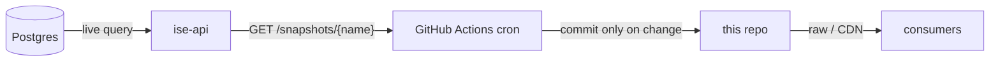

# ise-data

Public, machine-readable snapshots of the Israeli startup ecosystem.

Each file under [`snapshot/`](snapshot/) is generated live from Postgres by
[ise-api](https://github.com/pvalyou/ise-api) and committed here on a schedule.
Because every refresh is a commit, you can see exactly what changed and when
through the git history - the diff *is* the changelog.

## Consume the data

No API key, no rate limit, no server required - just read the JSON.

- Raw GitHub:
  `https://raw.githubusercontent.com/pvalyou/ise-data/main/snapshot/startups.json`
- CDN (cached, faster):
  `https://cdn.jsdelivr.net/gh/pvalyou/ise-data@main/snapshot/startups.json`

Start from [`snapshot/manifest.json`](snapshot/manifest.json) to discover what
is available. For fresher-than-commit data, query
[ise-api](https://github.com/pvalyou/ise-api) directly.

## How it updates

Three scheduled workflows fetch from ise-api by cadence tier and commit only
when content changed:

| Workflow | Cadence | Schedule |
| --- | --- | --- |
| [`snapshots-live.yml`](.github/workflows/snapshots-live.yml) | `live` | every 15 min |
| [`snapshots-intraday.yml`](.github/workflows/snapshots-intraday.yml) | `intraday` | hourly |
| [`snapshots-daily.yml`](.github/workflows/snapshots-daily.yml) | `daily` | daily |

The shared scripts [`scripts/fetch-snapshots.sh`](scripts/fetch-snapshots.sh)
and [`scripts/commit-snapshots.sh`](scripts/commit-snapshots.sh) do the work.
The fetch step reads the ise-api manifest and only pulls snapshots that are
both available and match the tier's cadence, so new snapshots appear here
automatically as they ship in ise-api.

## Setup

1. Deploy ise-api and note its public URL.
2. In this repo: Settings -> Secrets and variables -> Actions -> Variables,
   add a repository variable `API_BASE_URL` = the ise-api base URL.
3. The workflows use the default `GITHUB_TOKEN` to commit - no other secrets
   needed. Ensure Actions has write permission (Settings -> Actions -> General
   -> Workflow permissions -> Read and write).

## Notes on history size

Some snapshots are large (e.g. `network.json`, `jobs.json`). To keep the repo
healthy:

- Commits only happen when content changes (handled by the commit script).
- Tune cron frequency per tier to match how often data really moves.
- If churn on large files becomes heavy, consider git LFS for those files or a
  periodic history squash.
