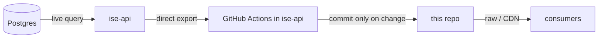

# ise-data

Public, machine-readable snapshots of the Israeli startup ecosystem.

Each file under [`snapshot/`](snapshot/) is generated live from Postgres by
[ise-api](https://github.com/pvalyou/ise-api) and committed here on a schedule.
Because every refresh is a commit, you can see exactly what changed and when
through the git history - the diff *is* the changelog.

## Consume the data

No API key, no rate limit, no server required - just read the JSON.

- Raw GitHub:
  `https://raw.githubusercontent.com/pvalyou/ise-data/main/snapshot/startups.json`
- CDN (cached, faster):
  `https://cdn.jsdelivr.net/gh/pvalyou/ise-data@main/snapshot/startups.json`

Start from [`snapshot/manifest.json`](snapshot/manifest.json) to discover what
is available.

## How it updates

Scheduled workflows in [ise-api](https://github.com/pvalyou/ise-api) export
snapshots directly from Postgres and commit changes here by cadence tier:

| Workflow (ise-api) | Cadence | Schedule |
| --- | --- | --- |
| `snapshots-live.yml` | `live` | every 15 min |
| `snapshots-intraday.yml` | `intraday` | hourly |
| `snapshots-daily.yml` | `daily` | daily |

Commits only happen when content changes. See
[ise-api migration docs](https://github.com/pvalyou/ise-api/blob/main/docs/migration/README.md)
for setup and architecture.

## Notes on history size

Some snapshots are large (e.g. `network.json`, `jobs.json`). To keep the repo
healthy:

- Commits only happen when content changes.
- Tune cron frequency per tier to match how often data really moves.
- If churn on large files becomes heavy, consider git LFS for those files or a
  periodic history squash.
